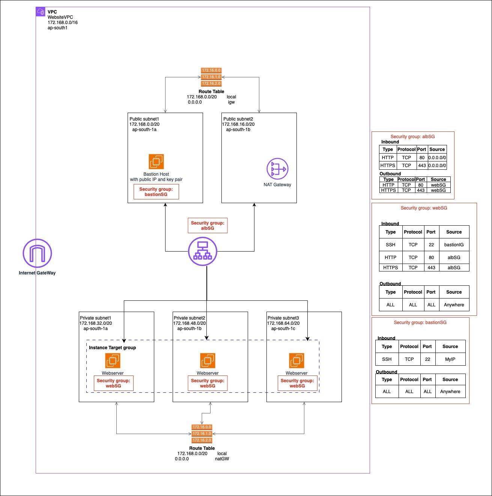

# AWS Infrastructure Setup

## Overview
This repository contains an AWS infrastructure setup script using AWS CLI. The script provisions a Virtual Private Cloud (VPC) with public and private subnets, security groups, NAT and Internet Gateways, EC2 instances, and an Application Load Balancer (ALB) to host a PHP-based HTTPD test site.

## Architecture


The infrastructure setup includes:
- **VPC**: Created in the `ap-south-1` region.
- **Subnets**:
  - 2 Public Subnets
  - 2 Private Subnets (distributed across `ap-south-1a` and `ap-south-1b`)
- **Networking Components**:
  - Internet Gateway for public subnet access
  - NAT Gateway for outbound traffic from private subnets
  - Route tables for public and private subnets
- **Security Groups**: Configured for the bastion host, web servers, and ALB.
- **EC2 Instances**:
  - A **bastion host** in a public subnet
  - **Two EC2 instances** in private subnets running a PHP HTTPD test site
- **Load Balancer**: An ALB to distribute traffic to the private EC2 instances

## File Structure
```
aws-cli-examples/
│── README.md
│── img/
│   └── arch.jpg
│── VPC/
│   └── vpc_creation.sh
│── EC2/
│   ├── userdata.sh
│   ├── create_ec2.sh
│   └── alb_setup.sh
```
 - **VPC/vpc-creation.sh :**    this script creates VPC, Subnets, Route tables, Internet Gateway, NAT Gateway, Security Groups
 - **EC2/create_ec2.sh :**      this script creates EC2 instances
 - **EC2/alb_setup.sh :**       this script creates Application Load Balancer, Target Group and Listners
 - **EC2/userdata.sh :**        userdata file for EC2 Creation
## Requirements
- AWS CLI
- IAM user with permissions to create and manage AWS resources
- Bash shell (for running scripts)

## Notes
- Ensure that the SSH key pair for the bastion host is properly configured to allow secure access.
- The PHP HTTPD test site is deployed automatically during the EC2 setup process.

